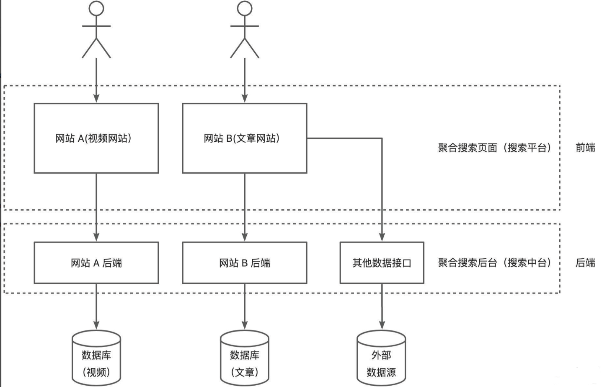

### 聚合搜索平台项目

#### 1. 项目介绍

##### 1.1 介绍

一个企业级聚合搜索平台（简化版的搜索中台）。

项目的意义：

- 用户角度：允许用户在同一个页面集中搜索出不同来源、不同类型的内容，提升用户的检索效率和搜索体验。
- 企业角度：当企业有多个项目的数据需要被搜索时，无需针对每个项目单独开发搜索功能，可以直接将数据接入搜索中台，提升开发效率。

##### 1.2 特点

-  SpringBoot 2.7
- 实践数据抓取=>数据同步=>搜索引擎等一系列业务开发
- 架构设计知识

##### 1.3 项目技术栈

###### 1.3.1 前端

- Vue
- Ant Design Vue
- Lodash

###### 1.3.2 后端

- Spring Boot
- MySQL
- Elasticsearch (Elastic Stack)搜索引擎
- 数据抓取
    - 离线
    - 实时
- 数据同步(4种同步方式)
    - 定时
    - 双写
    - Logstash
    - Canal
- JMeter压力测试
- Guava Retrying保证API的稳定性？

##### 1.4 业务流程

1. 先得到各种不同分类的数据

2. 提供一个搜索页面（单一搜索+聚合搜索），支持搜索

还可以做一些优化，比如关键词高亮、搜索建议、防抖节流：

项目架构图：

